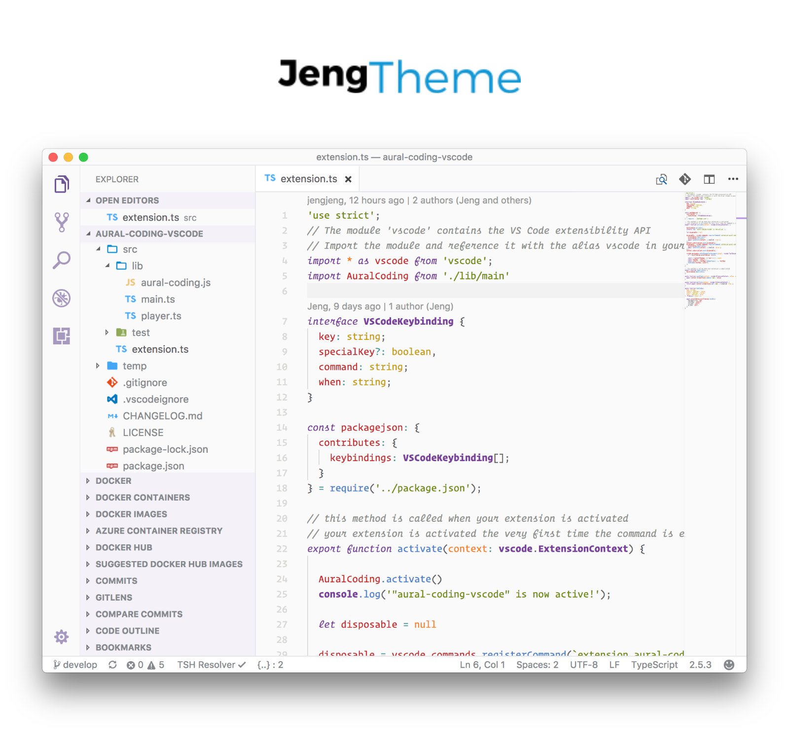

[](https://marketplace.visualstudio.com/items?itemName=jeng.jeng-theme-light)
[](https://marketplace.visualstudio.com/items?itemName=jeng.jeng-theme-light)
[](https://marketplace.visualstudio.com/items?itemName=jeng.jeng-theme-light)

The perfect peaceful combination of colors for light theme for Visual Studio Code.

## Install

```shell
ext install jeng-theme-light
```

Make sure you have installed [Operator Mono Font](https://www.typography.com/blog/introducing-operator). (which you can see on screenshots above).
Or you can install your own font with regular and italic presets.

After font installation you need to set vscode setting to

```
"editor.fontFamily": "Operator Mono, Consolas, 'Courier New', monospace"
```

Then go to `Preferences > Color Theme > Jeng Light`.

***
Enjoy